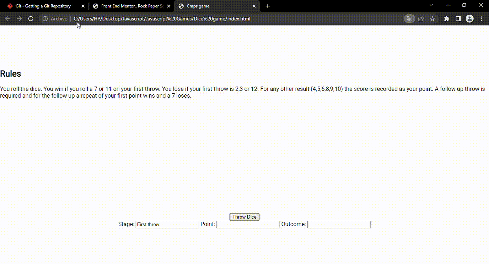

##Dice craps game

####Overview
Here is a simple dice game. The user rolls clicks the "Throw Dice" button and two dice are generated using the canvas element. The game has a set of rules which are compared based on the result of the random roll of both dice.

The rules are in the game and if a set of conditions are not met the value of the first roll is saved to a variable and then the user is given the opportunity to roll the dice again and the result of subsequent rolls is compared to the very first roll of the dice to determine if the user wins, loses or has to continue playing.
 

